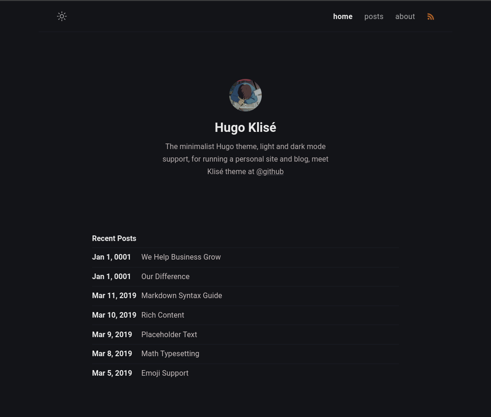

# Hugo-Klisé

This is a hugo theme inspired by the original jekyll theme -- [Klisé](https://github.com/piharpi/jekyll-klise) by [@piharpi](https://github.com/piharpi)



## Why?

- Simply because I use hugo and I love this theme :)
- Also for my [blog](https://h4r1337.github.io)

## Features

- Light & Dark Mode support :waxing_crescent_moon:
- Customizable (using `.scss`)
- Responsive (desktop, tab and mobile)
- Mobile First Design
- SEO Optimized
- Pagination
- [Custom shortcodes](#custom-shortcodes)
- FontAwesome icon support
- Google Analytics

### Built-in shortcodes

- `figure`(props required: `src`, props optional: `alt`, `caption`)
  - eg:

  ```markdown
  
  ```

- `image`(props required: `src`, props optional: `alt`)
  - eg:

  ```markdown
  
  ```

### Code highlighting

- Add this option to your `config.toml` file for enabling the custom gruvbox theme for code highlighting.

```toml
[markup]
  [markup.highlight]
    noClasses = false
```

- The default one is monokai.
- You can also use other themes provided by hugo by using this:

```toml
[markup]
  [markup.highlight]
    style = "gruvbox" # check here for more styles: https://xyproto.github.io/splash/docs/all.html
```

### Google Analytics

- To enable google analytics to your website add the below snippet to your `config.toml` file:

```toml
[services]
  [services.googleAnalytics]
    id = 'G-XXXXXXXXX' # Add your google analytics id here
```

## Installation

- Install theme

```bash
git submodule add -f https://github.com/h4r1337/hugo-klise themes/hugo-klise
```

- Edit your `config.toml`. Example can be seen [here](exampleSite/config.toml)

## TODO

### Major

- [ ] Add posts search feature
- [ ] Comments
- [ ] User customization options
  - Extended headers and footers
  - Custom css
  - More configuration options via config.toml
- [ ] Submit to hugo themes
- [x] Table of Content
- [x] Google Analytics
- [x] Add FontAwesome supoort
- [x] Add Shortcodes

### Minor

- [ ] GitInfo support
- [ ] Copy code
- [x] Automatic post summary view (using more tag)
- [x] Custom code highlight

